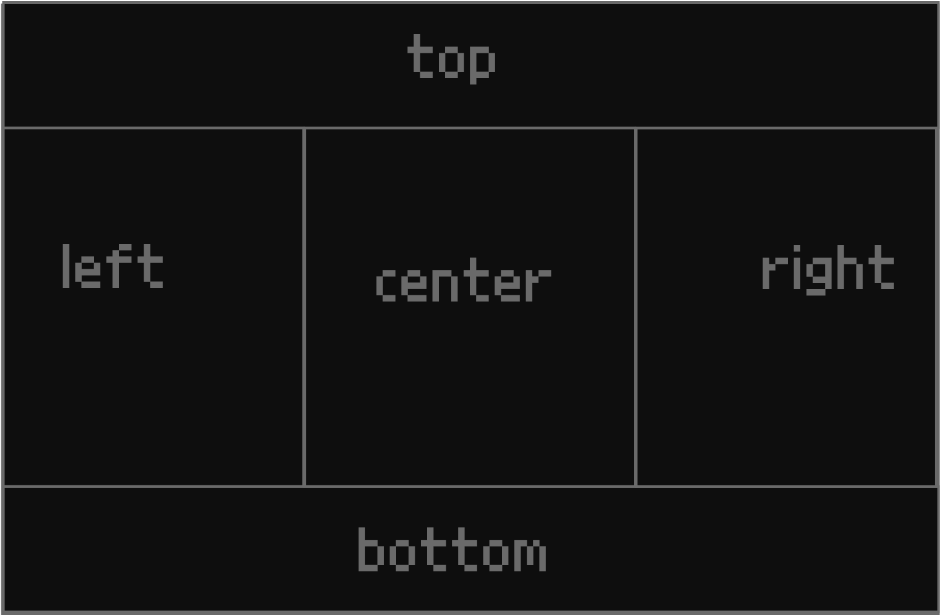

# componentUI
* summer 2023
  framework to build desktop apps with a simple format. Uses -UI components and webview2
 
the grid stucture is created using html and a special file assigns a UI component to each tile

### layout:

each section can be split into any 4 subsections (top bottom left right center). a full length/width bar can be added to any edge and also in layers. also tabs can be built in to each section without needing a subsection

## UI components:
* [Tabs-UI](https://github.com/kachbit/Tabs-UI)
* [FileTree-UI](https://github.com/kachbit/FileTree-UI) 
* [Menubar-UI](https://github.com/kachbit/Menubar-UI) 
* more coming soon
